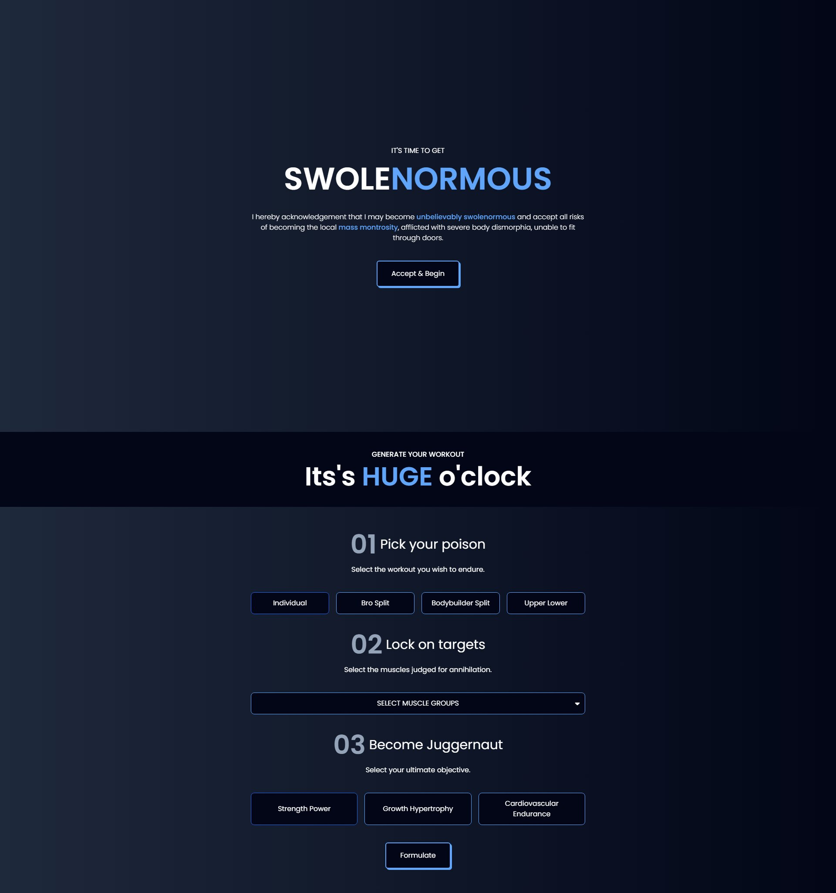

# React Fitness App  

  

## Overview  

I developed a dynamic web application that allows users to create personalized workout routines tailored to their fitness goals, preferences, and available equipment. The user-friendly interface makes it easy for users of all levels to design and manage their fitness journey.  

## Features  

- ✅ **Workout Customization:** Users can select exercises, set durations, and create their own workout plans based on personal goals.  
- ✅ **Responsive Design:** Optimized for desktops and mobile devices for accessibility on the go.  
- ✅ **Clean Code:** Code is written cleanly and with proper coding standards.  

## Technologies Used  

- **CSS**  
- **HTML**  
- **React.js**  
- **Tailwind CSS**  

## Impact  

This web application empowers users to take control of their fitness journey with personalized routines, ultimately promoting healthier lifestyles and helping users achieve their fitness goals.  

## Live Demo  

You can try the live application [here](https://react-fitness-guru-app.netlify.app/).  

## Installation  

To run this project locally, follow these steps:  

1. Clone the repository:  
   ```bash  
   git clone https://github.com/arbaz93/React-Fitness-App.git
2. Navigate to the project directory:
   ```bash  
   cd React-Fitness-App
3. Install the dependencies:
   ```bash  
   npm install
4. Start the development server:
   ```bash  
   npm run dev
Your application should now be running on http://localhost:5173.

## Contributing

Check out the project on GitHub: [React Fitness App](https://github.com/arbaz93/React-Fitness-App)  

## License

This project is licensed under the MIT License. See the [LICENSE](https://github.com/arbaz93/React-Fitness-App/blob/main/LICENSE) file for details.

## Acknowledgements

- Inspired by Smaljames
- React.js [documentation](https://legacy.reactjs.org/docs/getting-started.html)
- Tailwind CSS [documentation](https://tailwindcss.com/docs/installation)
